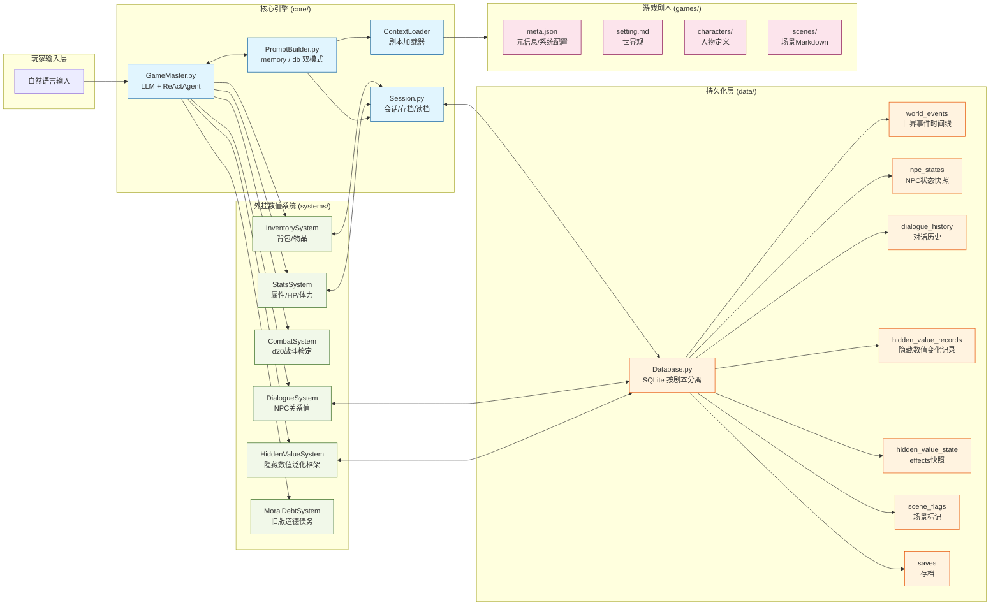

# RPGAgent

> 用大模型做跑团主持人的 RPG 游戏模拟工具

## 是什么

RPGAgent 是一个基于大模型上下文能力的 RPG 游戏引擎。核心思路：

**让 AI 当 DM（地下城主），你当玩家。**

- 游戏剧本、世界观、人物设定以结构化文件形式交给 AI 学习
- 玩家用自然语言描述想做的事，AI 读取当前数值状态后驱动叙事
- 战斗、道德抉择、理智、关系等数值系统独立于 LLM 运行，确保可验证性
- HiddenValueSystem：通用隐藏数值框架，支持任意多组数值并行、阈值触发、特场景插入
- 使用 SQLite 按剧本分离持久化，支持存档/读档

---

## 核心特性

| 特性 | 说明 |
|------|------|
| **隐藏数值框架** | 通用框架，配置驱动。道德债务/理智/声望等均可定义，支持阈值锁定选项、叙事语气/叙事风格变化、特场景触发 |
| **外挂数值系统** | 战斗/道德债务/声望/关系与 LLM 分离，结果可验证 |
| **SQLite 持久化** | 按剧本分离存储，世界事件/NPC状态/对话历史/隐藏数值全量记录 |
| **多线叙事** | 支持分支剧情、道德债务、关系变化、特场景触发等机制 |
| **存档系统** | JSON 序列化存档，随时读取/恢复（含历史记录） |
| **双模式 Prompt 构建** | memory 模式（内存数值系统）和 db 模式（SQLite 按需查询）二合一，支持 hidden_value_sys 直接注入 |
| **可测试** | systems/ 全套单元测试，**230 个测试全部通过** |

---

## 项目结构

```
RPGAgent/
├── README.md
├── requirements.txt
├── pytest.ini
│
├── config/
│   └── settings.py               # 全局配置（模型/路径/默认值）
│
├── core/                         # 核心引擎
│   ├── game_master.py            # 游戏主持人（集成 AgentScope ReActAgent）
│   ├── session.py                # 会话管理/存档/读档（GameState 快照）
│   ├── context_loader.py         # 剧本加载（meta/setting/characters/scenes）
│   ├── prompt_builder.py         # Prompt 构造器（memory 模式，数值直接注入）
│   └── context_builder.py        # Prompt 构造器（db 模式，按需从 SQLite 查询）
│
├── systems/                      # 外挂数值系统（纯 Python，可独立测试）
│   ├── stats.py                  # 角色属性（HP/体力/力量/敏捷/智力/魅力）
│   ├── combat.py                 # d20 战斗检定（支持优势/劣势/暴击）
│   ├── moral_debt.py             # 道德债务（旧版，向后兼容）
│   ├── inventory.py              # 背包/物品管理
│   ├── dialogue.py               # NPC 关系值系统
│   └── hidden_value.py           # 隐藏数值泛化框架（新标准）
├── data/
│   └── database.py               # SQLite 持久化层（全表 CRUD）
│
├── games/                        # 游戏剧本目录（用户放置）
│   └── example/                  # 示例剧本
│
├── api/                          # HTTP 接口层（可选）
│
└── tests/
    ├── conftest.py               # pytest fixtures
    ├── unit/                     # 单元测试
    │   ├── test_stats.py
    │   ├── test_combat.py
    │   ├── test_moral_debt.py
    │   ├── test_inventory.py
    │   ├── test_dialogue.py
    │   ├── test_hidden_value.py   # HiddenValue + HiddenValueSystem 全测试
    │   ├── test_context_builder.py # PromptBuilder memory/db 双模式测试
    │   ├── test_prompt_builder.py
    │   ├── test_session.py
    │   └── test_database.py
    └── integration/
        └── test_full_session_lifecycle.py  # 完整生命周期端到端测试
```

---

## 快速开始

### 1. 安装依赖

```bash
pip install -r requirements.txt
```

### 2. 配置 API Key

```bash
cp .env.example .env
# 编辑 .env，填入 OPENAI_API_KEY
```

### 3. 放入剧本

将剧本文件夹放入 `games/` 目录，至少包含：
- `meta.json` — 剧本元信息
- `setting.md` — 世界观总览
- `characters/` — 人物 JSON 文件
- `scenes/` — 场景 Markdown 文件

参考 `games/example/` 示例结构。

### 4. 启动游戏

```bash
python main.py
```

---

## 测试

```bash
python -m pytest tests/ -v
```

**当前：311 个测试全部通过**，覆盖所有数值系统和完整生命周期。

---

## 数值系统说明

所有 `systems/` 模块独立于 LLM 运行，可单独导入测试：

```python
from systems import StatsSystem, MoralDebtSystem, CombatSystem

stats = StatsSystem()
stats.take_damage(30)
print(stats.is_alive())  # True

combat = CombatSystem()
result = combat.full_attack({"strength": 16, "agility": 10, "armor": 10},
                             {"strength": 10, "agility": 10, "armor": 10})
print(result.message)
```

### 系统接口

| 系统 | 接口 | 说明 |
|------|------|------|
| 属性 | `IStatsSystem` | HP/体力/属性修改 |
| 战斗 | `ICombatSystem` | d20 检定 |
| 道德债务（旧）| `IMoralDebtSystem` | 债务累积/清算/选项锁定 |
| 背包 | `IInventorySystem` | 物品增删/使用 |
| 对话 | `IDialogueSystem` | NPC 关系值 |
| **隐藏数值（新）** | `HiddenValueSystem` | 通用多值框架，见下 |

---

## HiddenValueSystem — 隐藏数值泛化框架

通用框架，支持定义任意多组隐藏数值（道德债务/理智/声望/成长等），通过配置驱动，无需改代码。

### 核心概念

- **HiddenValue**：单个隐藏数值的完整定义（阈值档位、叙事语气、选项锁定、特场景触发）
- **HiddenValueSystem**：管理器，一次行为可同时触发多个数值变化
- **action_map**：行为标签 → 数值变化的映射，剧本配置中定义

### 阈值档位效果

每个阈值档位可配置：
- `narrative_tone`：叙事语气描述（如"内心开始有声音"）
- `narrative_style`：叙事风格（`normal` / `fragmented` / `dissociated`）
- `locked_options`：进入该档位后锁定的选项（如"主动干预"）
- `trigger_scene`：跨过该阈值时触发的场景 ID（由 GM 插入）

### 剧本配置示例（meta.json）

```json
{
  "hidden_values": [
    {
      "id": "moral_debt",
      "name": "道德债务",
      "direction": "ascending",
      "thresholds": [0, 11, 26, 51, 76],
      "decay_per_turn": 2,
      "decay_min_value": 0,
      "effects": {
        "0":  {"narrative_tone": "心境平和", "locked_options": []},
        "11": {"narrative_tone": "内心开始有声音", "locked_options": ["主动干预"], "trigger_scene": "guilt_flashback"},
        "26": {"narrative_tone": "你开始合理化沉默", "locked_options": ["主动干预", "积极行动"]},
        "51": {"narrative_tone": "你已经习惯了", "narrative_style": "fragmented", "locked_options": ["积极行动"]},
        "76": {"narrative_tone": "你已无法回头", "narrative_style": "dissociated", "locked_options": ["道德洁癖选项"]}
      }
    },
    {
      "id": "sanity",
      "name": "理智",
      "direction": "descending",
      "thresholds": [0, 30, 60],
      "decay_per_turn": 3,
      "decay_min_value": 0,
      "effects": {
        "0":  {"narrative_tone": "理智正常", "locked_options": []},
        "30": {"narrative_tone": "开始出现幻觉", "narrative_style": "fragmented"},
        "60": {"narrative_tone": "与现实脱节", "narrative_style": "dissociated", "locked_options": ["冷静对话"], "trigger_scene": "insanity_breakdown"}
      }
    }
  ],
  "hidden_value_actions": {
    "silent_witness":  {"moral_debt": 5,  "sanity": -2},
    "help_victim":     {"moral_debt": -3, "sanity": 3},
    "violent_act":     {"moral_debt": 10, "sanity": -8}
  }
}
```

### 代码使用

```python
from systems.hidden_value import HiddenValueSystem

hvs = HiddenValueSystem(
    configs=[...],  # hidden_values 配置列表
    action_map={...}  # hidden_value_actions
)

# 根据行为标签触发多个数值同时变化
deltas, triggered = hvs.record_action(
    action_tag="silent_witness",
    scene_id="scene_01",
    turn=3,
    player_action="袖手旁观",
)
# deltas = {"moral_debt": 5, "sanity": -2}
# triggered = {"moral_debt": None, "sanity": None}  # 未跨阈

# 每回合推进：对所有配置了 decay_per_turn 的数值自动衰减
decay_results = hvs.tick_all(turn=4)
# decay_results = {"moral_debt": (3, None), "sanity": (27, None)}

# 直接查询当前锁定选项（供 PromptBuilder 使用）
locked = hvs.get_locked_options()  # ["主动干预", ...]

# 持久化到数据库（含衰减配置）
hvs.save_to_db(db)

# 从数据库加载（含衰减配置恢复）
hvs.load_from_db(db)
```

### decay — 回合衰减配置

```json
{
  "id": "rapport",
  "name": "好感度",
  "direction": "ascending",
  "thresholds": [0, 20, 50],
  "decay_per_turn": 3,      // 每回合减少 3（不互动则好感自然衰减）
  "decay_min_value": 0,      // 衰减下限，不可低于 0
  "effects": { ... }
}
```

| 字段 | 类型 | 说明 |
|------|------|------|
| `decay_per_turn` | `int` | 每回合自动衰减量（正值），0 = 不衰减 |
| `decay_min_value` | `int?` | 衰减下限，`null` = 无下限（可衰减到负值） |

调用 `tick_all(turn)` 后，所有配置了 `decay_per_turn > 0` 的数值自动减少对应量。衰减产生的 level 下降**不触发**任何 `trigger_scene`。

### direction 说明

- `ascending`：值越高越糟（如道德债务）。跨过阈值 → 锁定选项
- `descending`：值越高越好（如理智）。值低于阈值 → 锁定选项

---

## GM_COMMAND 协议

LLM 返回叙事时，通过 `[GM_COMMAND]` 块向系统发指令：

```
[GM_COMMAND]
action: narrative | choice | combat | transition
next_scene: <scene_id>（如果是 transition）
options: <选项列表>（如果是 choice，格式：选项名|描述|触发条件）
combat_data: <战斗数据>（如果是 combat）
narrative_hint: <给玩家的叙事内容>
action_tag: <本次玩家行为触发的数值标签，如 silent_witness / help_victim>
[/GM_COMMAND]
```

支持的指令字段：

| 字段 | 说明 |
|------|------|
| `action` | `narrative` / `choice` / `combat` / `transition` |
| `next_scene` | 切换到指定场景 |
| `action_tag` | 触发的隐藏数值行为标签（如 `silent_witness`），系统自动根据 `hidden_value_actions` 更新对应数值 |
| `relation_delta` | 增减 NPC 关系值 |
| `npc_id` | 指定 NPC ID |
| `stat_delta` / `stat_name` | 增减角色属性 |

---

## 自建剧本

### 目录结构

```
games/你的剧本/
├── meta.json          # 必需
├── setting.md         # 必需
├── characters/        # 人物 JSON/YAML
├── scenes/           # 场景 Markdown
└── systems.yaml      # 可选，覆盖默认数值
```

### meta.json 完整示例

```json
{
  "name": "秦末·大泽乡",
  "version": "1.0",
  "author": "GM",
  "summary": "公元前209年，你是一名被征召的戍卒...",
  "tags": ["历史", "战争", "道德抉择"],
  "first_scene": "scene_01",
  "systems_enabled": {
    "moral_debt": true,
    "combat": true
  },
  "hidden_values": [
    {
      "id": "moral_debt",
      "name": "道德债务",
      "direction": "ascending",
      "thresholds": [0, 11, 26, 51, 76],
      "effects": {
        "0":  {"narrative_tone": "心境平和"},
        "11": {"narrative_tone": "内心开始有声音", "trigger_scene": "guilt_flashback"},
        "26": {"narrative_tone": "你开始合理化沉默", "locked_options": ["主动干预"]},
        "51": {"narrative_tone": "你已经习惯了", "locked_options": ["积极行动"]},
        "76": {"narrative_tone": "你已无法回头", "locked_options": ["道德洁癖选项"]}
      }
    }
  ],
  "hidden_value_actions": {
    "silent_witness":  {"moral_debt": 5},
    "help_victim":     {"moral_debt": -3},
    "lie_to_npc":      {"moral_debt": 8}
  }
}
```

---

## 架构概览



### 数据流向

```
1. 玩家输入自然语言
       ↓
2. GameMaster（LLM）读取 PromptBuilder 组装的完整上下文
       ↓
3. LLM 返回叙事 + [GM_COMMAND] 结构化指令
       ↓
4. GameMaster 解析指令：
   • action_tag      → HiddenValueSystem.record_action() 更新隐藏数值
   • relation_delta  → DialogueSystem 更新 NPC 关系
   • stat_delta      → StatsSystem 修改角色属性
   • next_scene      → SceneManager 切换场景
       ↓
5. 数值系统变更 → Database 持久化（SQLite，按剧本分离）
       ↓
6. 下一轮：PromptBuilder 重新组装上下文（含最新状态）→ 循环
```

### PromptBuilder 双模式

| 模式 | 数据来源 | 适用场景 |
|------|----------|----------|
| **memory**（默认） | 内存中数值系统实例直接读取 | 开发/短流程/高并发 |
| **db** | SQLite 按需查询 | 长流程/真实游戏/存档恢复 |

HiddenValueSystem 通过 `save_to_db()` / `load_from_db()` 与数据库往返，确保状态不丢失。

---

## 许可

MIT License
